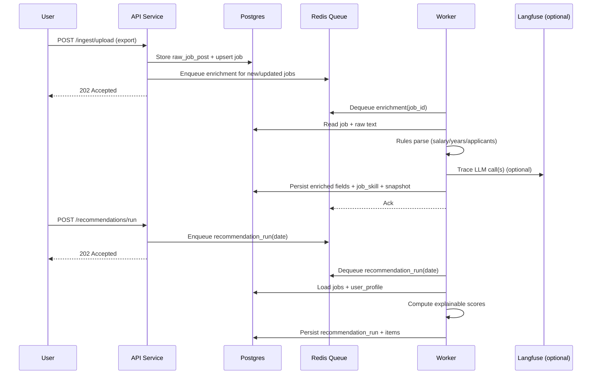

# Job Market Intelligence Platform (JMIP) – Architecture

## 1. Purpose

This document describes the high-level architecture of the Job Market Intelligence Platform (JMIP): components, boundaries, core workflows, and the design principles that guide implementation decisions. It is intentionally implementation-agnostic where possible, focusing on *system shape* and *operational correctness*.

---

## 2. Architectural Principles

### 2.1 Backend-first, data-driven
JMIP is designed as a durable backend system that stores job data as structured facts. Recommendations and analytics are computed deterministically from persisted data.

### 2.2 Deterministic-first, LLM-augmented
AI-assisted enrichment (LLMs) is an augmentation layer, not a dependency for core system operation. The system remains functional when the LLM layer is degraded or unavailable.

### 2.3 Stateless compute, stateful storage
API and worker processes are designed to be stateless and horizontally scalable. Durable state (jobs, workflow state, snapshots, reports) lives in the database and queue infrastructure.

### 2.4 Idempotent pipelines
Ingestion, enrichment, and report generation are designed to be safe under retries. Reprocessing inputs does not create duplicates or inconsistent state.

### 2.5 Observable by default
The system emits structured logs, metrics, and traces for API requests and asynchronous workflows. AI enrichment is traced and versioned to support debugging and evaluation.

### 2.6 Extensible connectors
External platforms (LinkedIn, Upwork, etc.) are isolated behind connector interfaces to enable future expansion without changes to core domain logic.

---

## 3. High-Level Component Model

JMIP is organized as a modular monolith with distinct runtime processes:

- **API Service (FastAPI):** synchronous request/response endpoints for ingestion triggers, querying jobs, recommendations, and reports.
- **Worker Service:** asynchronous execution of ingestion/enrichment/report jobs.
- **Persistent Store (Postgres):** source of truth for normalized job data, snapshots, workflow state, recommendations, and weekly reports.
- **Queue/Cache (Redis):** job queue for background work, plus optional caching for expensive reads.
- **LLM Observability (Langfuse):** tracing and prompt/version management for AI-assisted enrichment (optional but recommended).
- **MCP Server (optional):** tool interface for agentic clients and future UI integrations.

### 3.1 Component Diagram

```mermaid
flowchart LR
  U[User / CLI / UI] --> API[JMIP API Service
(FastAPI)]

  API -->|enqueue jobs| Q[(Redis Queue)]
  API -->|read/write| DB[(Postgres)]

  Q --> W[JMIP Worker Service]
  W -->|read/write| DB
  W -->|cache| R[(Redis Cache)]

  W -. optional traces .-> LF[Langfuse
(LLM traces/prompts)]
  W -. optional tools .-> MCP[MCP Server
(tool surface)]

  subgraph External Sources
    P1[LinkedIn]
    P2[Upwork]
    P3[Future Platforms]
  end

  API <-->|ingest exports / connector calls| External Sources
```

---

## 4. Domain Boundaries

JMIP separates concerns into stable layers:

- **Connectors:** platform-specific acquisition and parsing into raw payloads.
- **Normalization:** canonical job model, deduplication, and snapshot generation.
- **Enrichment:** rule-based extraction + optional LLM extraction, with validation and provenance.
- **Decisioning:** explainable scoring, daily recommendations, and weekly analytics.
- **Observability:** logs, metrics, tracing, and LLM-specific traces.

This separation keeps the system maintainable and supports incremental expansion.

---

## 5. Core Workflows

JMIP runs two primary workflows: **daily** (acquisition + recommendations) and **weekly** (market analysis + gap analysis).

### 5.1 Daily Workflow (Acquire → Normalize → Enrich → Recommend)

1. Discover jobs using keyword sets (via uploads, alerts, or connectors).
2. Persist raw payloads for traceability.
3. Normalize to canonical job schema.
4. Deduplicate and update existing records.
5. Enrich structured fields (rules first, LLM optional).
6. Generate daily recommendations with explainable scoring and CV/portfolio tailoring guidance.

#### Daily Sequence



### 5.2 Weekly Workflow (Aggregate → Analyze → Recommend Learning)

1. Aggregate job data for the week (roles, skills, locations, competition signals).
2. Compute trends and distributions deterministically from persisted structured data.
3. Gap analysis: compare demanded skills vs user profile and portfolio.
4. Produce a weekly report artifact (JSON + markdown summary) for review and reproducibility.

---

## 6. Data and State Management

### 6.1 Source of truth
Postgres is the system of record for:

- canonical job records
- snapshot history (job changes over time)
- extracted skills with provenance and confidence
- enrichment/job-run states
- recommendation outputs
- weekly reports

Redis is used for:

- background job queueing
- optional caching for expensive reads

### 6.2 Idempotency and deduplication (architecture-level)
Idempotency is enforced via:

- stable identifiers when available: `(platform, external_id)`
- normalized URL where applicable
- content hashing for raw payloads and descriptions
- database constraints to prevent duplicates
- upsert patterns for canonical job records
- snapshot tables to track changes instead of overwriting history

### 6.3 Snapshot strategy
JMIP stores job “current state” plus a historical record of changes:

- `job` holds the latest known values
- `job_snapshot` records significant changes (e.g., applicant count, description hash, salary fields)

This enables week-over-week trend analysis, backtesting of scoring changes, and debugging.

---

## 7. Enrichment Architecture (Rules + LLM)

Enrichment converts unstructured job text into structured fields used by scoring and analytics.

### 7.1 Deterministic-first
JMIP prioritizes rule-based extraction for fields that can be reliably parsed:

- years of experience
- salary ranges
- applicant counts
- remote/hybrid/on-site markers (when explicit)

### 7.2 LLM-augmented extraction (optional)
LLMs may be used to extract and classify fields that are semantically rich or ambiguous:

- skill lists (must-have vs nice-to-have)
- role family classification
- seniority normalization
- CV tailoring suggestions (grounded to known portfolio items)

### 7.3 Workflow orchestration with LangGraph
When enabled, LangGraph models enrichment as a state machine with retries and validation gates.

Example enrichment states:

- `RAW_INGESTED`
- `RULES_PARSED`
- `LLM_EXTRACTED`
- `VALIDATED`
- `PERSISTED`
- `FAILED_RETRYABLE`
- `FAILED_FINAL`

This supports resumability, partial completion, and reliable operation under transient failures.

---

## 8. Recommendation Engine (Explainable Scoring)

JMIP’s daily recommendations are computed via an explainable scoring model that combines multiple factors:

- skill overlap between job requirements and user profile
- seniority and experience fit
- remote/location compatibility
- recency / freshness
- competition proxy (e.g., applicant count when available)
- optional salary signals (when present)

### 8.1 Explainability requirements
Every recommendation stores a score breakdown (e.g., JSON) so results can be audited and compared across iterations. This enables:

- debugging unexpected rankings
- iterative tuning of weights
- stable, reproducible evaluation

---

## 9. Observability and Operations

JMIP is designed to be operable under real-world conditions.

### 9.1 Logs
- Structured logs for key events: ingestion, dedup hits, state transitions, retries, failures, report generation, recommendation runs.

### 9.2 Metrics
- Throughput: jobs ingested/day, enrichment jobs/hour
- Reliability: success rate, retry rate, dead-letter rate
- Performance: API latency, worker task latency, DB query latency
- Cost: LLM token usage and latency (when enabled)

### 9.3 Traces
- End-to-end traces across API → queue → worker → DB for long-running workflows.
- LLM spans traced via Langfuse with prompt versioning and metadata.

### 9.4 Failure handling
- Retryable failures use bounded retries with exponential backoff.
- Non-retryable failures are routed to a dead-letter state with clear diagnostics.
- Partial enrichment is supported: the system continues operating even with incomplete enrichment.

---

## 10. Security and Access Control (MVP-ready)

JMIP begins as a single-user system but adopts patterns compatible with future expansion.

- API authentication: API key or JWT (implementation choice)
- Least privilege for secrets and LLM credentials
- Rate limiting for external connectors and AI-assisted enrichment
- Audit logging for administrative operations (keyword updates, profile updates)

---

## 11. Extensibility

### 11.1 Platform expansion
New job platforms are added by implementing a connector that outputs raw job payloads and optional detail fetches. The normalization pipeline remains unchanged.

### 11.2 Feature expansion
The architecture supports incremental additions without redesign:

- new enrichment classifiers (e.g., industry tagging)
- additional competition heuristics
- richer portfolio/profile modeling
- optional RAG layer (document storage + embeddings) for Q&A over job corpora

---

## 12. Open Design Questions (to be resolved during implementation)

- Connector ingestion mode per platform (exports, alerts, APIs, optional scraping module)
- Queue framework selection (RQ vs Celery vs Arq)
- Multi-tenant evolution strategy (schema-per-tenant vs tenant_id partitioning)
- Evaluation harness for enrichment quality and recommendation relevance

These will be addressed as part of learning-first implementation milestones.

---
